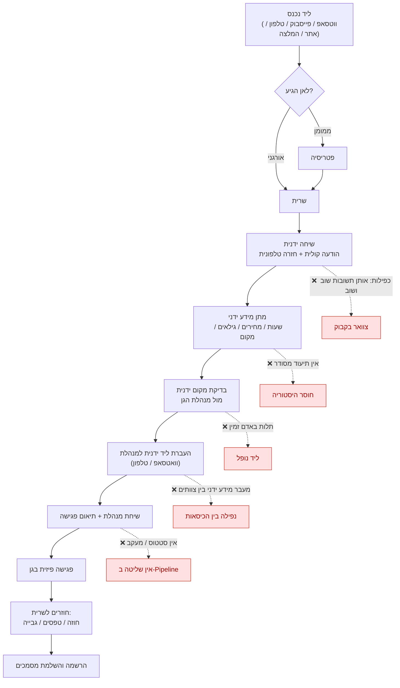
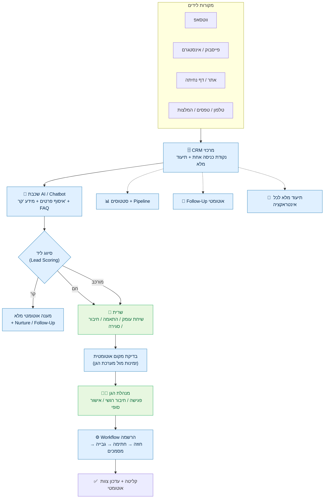

# מסמך אפיון מערכת CRM + AI + Automation
## ניהול לידים, שירות ורישום לגני ילדים

| שדה | פירוט |
|---|---|
| **שם המערכת** | מערכת ניהול קשר הורים (Parent CRM) — לידים, שירות והרשמה |
| **סוג מסמך** | מסמך אפיון עסקי-תפעולי (Business & Operations Spec) — תשתית לאפיון טכנולוגי מלא |
| **קהל יעד** | Product / CRM / Operations / Automation / Development |
| **גרסה** | 1.0 |
| **סטטוס** | טיוטה לאישור — מוכן ליישום |

---

## תוכן עניינים

1. [מטרת המסמך ותקציר מנהלים](#1-מטרת-המסמך-ותקציר-מנהלים)
2. [מקורות לידים וכניסת ליד](#2-מקורות-לידים-וכניסת-ליד)
3. [התהליך הקיים — תיאור מלא שלב אחר שלב](#3-התהליך-הקיים--תיאור-מלא-שלב-אחר-שלב)
4. [הבעיה המרכזית ונקודות הכאב](#4-הבעיה-המרכזית-ונקודות-הכאב)
5. [מידע "קר" מול מידע "חם"](#5-מידע-קר-מול-מידע-חם)
6. [מצב קיים מול מצב רצוי — טבלה השוואתית](#6-מצב-קיים-מול-מצב-רצוי--טבלה-השוואתית)
7. [המבנה הרצוי — שלבי המערכת](#7-המבנה-הרצוי--שלבי-המערכת)
8. [התהליך האידיאלי וחלוקת העומס](#8-התהליך-האידיאלי-וחלוקת-העומס)
9. [חלוקת אחריות בין AI לבני אדם](#9-חלוקת-אחריות-בין-ai-לבני-אדם)
10. [מטריצת אחריות (RACI)](#10-מטריצת-אחריות-raci)
11. [סטטוסים במערכת (Lifecycle)](#11-סטטוסים-במערכת-lifecycle)
12. [תרשימי Flow](#12-תרשימי-flow)
13. [דרישות טכנולוגיות](#13-דרישות-טכנולוגיות)
14. [מודל הנתונים (Data Model)](#14-מודל-הנתונים-data-model)
15. [מדדי הצלחה (KPIs)](#15-מדדי-הצלחה-kpis)
16. [מטרת העל](#16-מטרת-העל)

---

## 1. מטרת המסמך ותקציר מנהלים

### 1.1 מטרת המסמך
לייצר תשתית מדויקת לקראת אפיון טכנולוגי מלא של מערכת **CRM + AI + Automation** לניהול כל הקשר מול ההורים — מרגע כניסת הליד ועד הרשמה מלאה לגן.

### 1.2 הבעיה בקצרה
כיום כל מסע הלקוח (Parent Journey) מתבצע **ידנית ומפוזר** בין מספר אנשים וערוצים. נוצר ערבוב בין שש פונקציות שונות בידי אותם בעלי תפקיד:

```
מידע טכני • מכירה • שירות • התאמה רגשית • תפעול • הרשמה
```

התוצאה: עומס תפעולי גבוה, לידים שנופלים, חוסר תיעוד, וכפילות בעבודה.

### 1.3 הפתרון בקצרה
הפרדה בין שני סוגי מידע ומיכון של החלק החוזר:

| שכבה | מי מטפל | אחוז עומס יעד |
|---|---|---|
| **מידע "קר"** (טכני, חוזר) | AI / Chatbot / WhatsApp / טופס חכם | **70%** |
| **שירות והתאמה** (סינון, חיבור, סגירה) | שרית | **20%** |
| **חיבור רגשי וסגירה סופית** (פגישה, אמון) | מנהלת הגן | **10%** |

### 1.4 עקרון מנחה
> **לא להחליף את שרית או את המנהלות — אלא להוריד מהן את העומס הטכני, כדי שיתמקדו במה שבאמת סוגר הורה: אמון, חיבור אישי, ביטחון והתאמה רגשית.**

---

## 2. מקורות לידים וכניסת ליד

### 2.1 מקורות לידים

| קטגוריה | מקורות | יעד נוכחי |
|---|---|---|
| **קמפיינים ממומנים** | פייסבוק (Ads), אינסטגרם (Ads), דפי נחיתה | ➡️ פטריסיה |
| **לידים אורגניים / מפוזרים** | ווטסאפ, שיחות טלפון, אתר, טפסים, המלצות, הורים קיימים | ➡️ שרית |

### 2.2 ריכוז ערוצי הכניסה
* ווטסאפ
* פייסבוק
* אינסטגרם
* המלצות (Referrals)
* אתר אינטרנט
* שיחות טלפון
* הורים קיימים
* טפסים
* דפי נחיתה

### 2.3 נקודת הכאב בכניסה
> אין **נקודת כניסה מרכזית אחת**. כל ערוץ זורם לאדם אחר, ללא תיעוד אחיד וללא בקרה. ליד יכול "ליפול בין הכיסאות" ברגע הראשון.

---

## 3. התהליך הקיים — תיאור מלא שלב אחר שלב

### שלב 1 — כניסת ליד
ליד נכנס דרך אחד הערוצים ומגיע לפטריסיה (ממומן) או לשרית (אורגני).

### שלב 2 — יצירת קשר ראשוני (שרית)
* שולחת הודעה קולית
* חוזרת להורה טלפונית
* שואלת "במה אפשר לעזור?"
* מתחילה להבין את הצורך

**מידע שנאסף:** גיל הילד · אזור מגורים · סניף רלוונטי · תאריך כניסה רצוי · מה ההורה מחפש.

### שלב 3 — מתן מידע ראשוני (שרית)
שעות פעילות · ימי שישי · גילאים · סוג המסגרת · אווירה בגן · מיקום · מחירים בסיסיים · האם יש מקום פנוי.

### שלב 4 — בדיקת מקום פנוי (שרית ↔ מנהלת)
האם יש מקום · האם הגיל מתאים · האם התאריך אפשרי · האם נדרשות התאמות מיוחדות.

### שלב 5 — העברת ליד למנהלת (שרית ➡️ מנהלת)
שם ההורה · טלפון · גיל הילד · תאריך כניסה · סיכום קצר של השיחה · דברים חשובים שעלו.

### שלב 6 — שיחת מנהלת הגן
יוצרת קשר · מתאמת פגישה · מציגה את הגן · פוגשת את ההורים · מציגה את הצוות · בונה חיבור רגשי ואמון.

### שלב 7 — תהליך הרשמה (חוזר לשרית)
חוזה · הסכם · טפסים · רישום · אישור · גבייה · מסמכים.

### שלב 8 — סיום הרשמה
ההורה שולח: הסכם חתום · אישור הרשמה · מסמכים נדרשים.
➡️ הילד נכנס למערכת · הצוות מתעדכן · מתחיל תהליך קליטה.

---

## 4. הבעיה המרכזית ונקודות הכאב

### 4.1 הבעיה המרכזית
ערבוב בין שש פונקציות שונות בידי אותם אנשים, וכולן מתבצעות ידנית:

```
1. מידע טכני   2. מכירה   3. שירות
4. התאמה רגשית   5. תפעול   6. הרשמה
```

### 4.2 נקודות כאב מפורטות

| # | נקודת כאב | תיאור | השפעה עסקית |
|---|---|---|---|
| 1 | **פיזור לידים** | אין מקום מרכזי אחד | אובדן לידים, חוסר שליטה |
| 2 | **תלות באנשים** | אם מישהו לא עונה → הליד נופל | זמן תגובה ארוך, נטישה |
| 3 | **חוסר תיעוד** | אין היסטוריית אינטראקציות מסודרת | אין למידה, אין מעקב |
| 4 | **חוסר סטטוסים** | לא יודעים מי חזר / קבע / סגר / נפל | אין pipeline, אין תחזית |
| 5 | **כפילות** | שרית עונה שוב ושוב על אותן שאלות | בזבוז זמן יקר |
| 6 | **מעבר מידע לא מסודר** | בין שרית ↔ מנהלת ↔ כספים ↔ גן | טעויות, נפילות בין צוותים |
| 7 | **מנהלת נכנסת מוקדם מדי** | מטפלת גם בשאלות טכניות | בזבוז המשאב היקר ביותר |

---

## 5. מידע "קר" מול מידע "חם"

### 5.1 סוג 1 — מידע "קר" (ניתן למיכון מלא)
מידע טכני חוזר שאפשר לתת אוטומטית דרך **צ׳אטבוט / WhatsApp AI / טופס חכם / מערכת אוטומטית**.

| קטגוריה | דוגמאות |
|---|---|
| **שעות** | מתי פותחים · ימי שישי · שעות פעילות |
| **מידע בסיסי** | גילאים · סניפים · כתובות · מחירים התחלתיים · ארוחות · מצלמות · סדר יום |
| **תהליך** | איך נרשמים · איך קובעים פגישה · אילו מסמכים צריך |
| **שאלות חוזרות (FAQ)** | יש מקום? · כמה ילדים בגן? · יש הסתגלות? · יש צהרון? · עובדים באוגוסט? |

### 5.2 סוג 2 — מידע "חם" (חייב מגע אנושי)
החלק האנושי — כאן שרית והמנהלת **קריטיות**.

* חששות של הורים
* התאמה רגשית
* פחדים / חרדת מעבר ראשון למסגרת
* ילד רגיש / צורך מיוחד
* בעיות שינה / אוכל
* הורה לחוץ
* שיחת מחירים לעומק ומשא ומתן
* חיבור אישי ובניית אמון
* תחושת ביטחון
* "האם זה המקום הנכון לילד שלי?"

### 5.3 עיקרון ההפרדה
> **מידע קר = אוטומציה. מידע חם = אדם.** המערכת מנתבת כל פנייה לשכבה הנכונה במקום שהכול יעבור דרך בן אדם.

---

## 6. מצב קיים מול מצב רצוי — טבלה השוואתית

| מצב קיים | מצב רצוי | משימה נדרשת |
|---|---|---|
| כניסת ליד מפוזרת | מערכת מרכזית אחת | **CRM מרכזי** |
| שרית עונה שוב ושוב | AI נותן מענה בסיסי | **בניית AI / Chatbot** |
| סינון ידני | סיווג אוטומטי | **מנגנון סיווג (Lead Scoring)** |
| בדיקות ידניות | מערכת מרכזת מידע | **אוטומציות** |
| שאלות חוזרות | FAQ אוטומטי | **מאגר מידע / Knowledge Base** |
| מנהלת נכנסת מאוחר / מוקדם מדי | ליד איכותי בלבד מגיע אליה | **סינון לידים** |
| הרשמה מפוזרת | תהליך ברור | **Workflow הרשמה** |
| מעקב ידני | סטטוסים מסודרים | **מערכת סטטוסים (Pipeline)** |
| תיעוד חלקי | תיעוד מלא | **CRM (Activity Log)** |
| מעבר מידע ידני | אוטומציה בין צוותים | **התממשקויות (Integrations)** |

---

## 7. המבנה הרצוי — שלבי המערכת

### שלב 1 — AI / צ׳אטבוט
**אוסף:** שם · טלפון · גיל ילד · אזור · תאריך כניסה · מה מחפשים · סניף רצוי.
**נותן:** מידע בסיסי (מידע "קר") + מענה ל-FAQ + קביעת שיחה.

### שלב 2 — סיווג (Classification)
המערכת מזהה ומתייגת את הליד:
* ליד **"קר"** — מספיק לו מענה אוטומטי
* ליד **"חם"** — מוכן להתקדם, מצריך שיחת שרית
* ליד **"מורכב"** — צורך מיוחד / חשש מהותי

### שלב 3 — שרית
**מקבלת:** כל הנתונים · סיכום AI · שאלות שנשאלו · גן רלוונטי · סטטוס מקום פנוי.
**מבצעת:** שיחת עומק · התאמה · חיבור · סגירה.

### שלב 4 — מנהלת
מקבלת **רק לידים איכותיים ורלוונטיים**.
* **לא מתעסקת ב:** שעות · מחירים בסיסיים · שאלות טכניות.
* **מתמקדת ב:** התאמה · חיבור · אמון · התרשמות · סגירה רגשית.

---

## 8. התהליך האידיאלי וחלוקת העומס

```
┌─────────────────────────────────────────────────────────┐
│  AI / Automation   →  70%   שאלות חוזרות, מידע "קר", FAQ   │
│  שרית              →  20%   התאמות, שיחות, חיבור, סגירה     │
│  מנהלת הגן          →  10%   פגישה, התרשמות, אמון, אישור סופי │
└─────────────────────────────────────────────────────────┘
```

| שכבה | תחומי טיפול | אחוז יעד |
|---|---|---|
| **AI** | מידע "קר", FAQ, איסוף פרטים, קביעת שיחה | 70% |
| **שרית** | התאמות, שיחת עומק, בניית קשר, סגירה | 20% |
| **מנהלת** | פגישה, התרשמות, חיבור רגשי, אישור סופי | 10% |

---

## 9. חלוקת אחריות בין AI לבני אדם

| תחום | AI | בן אדם |
|---|:---:|:---:|
| שעות | ✔ | |
| מחירים בסיסיים | ✔ | |
| גילאים | ✔ | |
| כתובות | ✔ | |
| שאלות חוזרות | ✔ | |
| קביעת שיחה | ✔ | |
| בדיקת מקום | חלקית | ✔ |
| התאמה רגשית | | ✔ |
| חששות | | ✔ |
| משא ומתן | | ✔ |
| פגישה | | ✔ |
| סגירת הרשמה | חלקית | ✔ |

**מקרא:** ✔ = אחריות מלאה · "חלקית" = AI מכין/מתעד, האדם מכריע.

---

## 10. מטריצת אחריות (RACI)

> **R** = מבצע · **A** = אחראי-על · **C** = מתייעצים איתו · **I** = מעודכן

| פעילות | AI/CRM | שרית | מנהלת גן | כספים/גבייה |
|---|:---:|:---:|:---:|:---:|
| כניסת ליד ותיעוד | **R/A** | I | | |
| מענה למידע "קר" + FAQ | **R/A** | I | | |
| איסוף פרטים ראשוני | **R** | A | | |
| סיווג ליד (Scoring) | **R** | A | I | |
| בדיקת מקום פנוי | C | **R** | **A** | |
| שיחת עומק והתאמה | I | **R/A** | C | |
| העברת ליד למנהלת | **R** | A | I | |
| פגישה וסגירה רגשית | I | C | **R/A** | |
| שליחת חוזה וטפסים | **R** | **A** | I | I |
| גבייה ותשלום | I | C | I | **R/A** |
| קליטה ועדכון צוות | **R** | I | **A** | I |

---

## 11. סטטוסים במערכת (Lifecycle)

| # | סטטוס | בעלים | מעבר אוטומטי? |
|---|---|---|:---:|
| 1 | ליד חדש | AI/CRM | — |
| 2 | נשלח מענה אוטומטי | AI | ✔ |
| 3 | ממתין לשיחת שרית | שרית | ✔ |
| 4 | נאספו פרטים | AI/שרית | ✔ |
| 5 | ממתין לבדיקה מול גן | שרית | |
| 6 | יש מקום | מנהלת | |
| 7 | אין מקום | מנהלת | |
| 8 | הועבר למנהלת | שרית | ✔ |
| 9 | נקבעה פגישה | מנהלת | |
| 10 | לאחר פגישה | מנהלת | |
| 11 | מעוניינים בהרשמה | מנהלת/שרית | |
| 12 | נשלח חוזה | שרית | ✔ |
| 13 | ממתין לחתימה | שרית | |
| 14 | נרשם | שרית | |
| 15 | הושלם תשלום | כספים | ✔ |
| 16 | הסתיים תהליך | CRM | ✔ |

---

## 12. תרשימי Flow

### 12.1 תרשים 1 — מצב קיים (As-Is)



**מאפייני המצב הקיים:** עבודה ידנית מקצה לקצה · צווארי בקבוק · כפילויות · חוסר תיעוד · אין סטטוסים.

---

### 12.2 תרשים 2 — מצב רצוי (To-Be)



**מאפייני המצב הרצוי:** CRM מרכזי · AI למידע קר · סיווג אוטומטי · אוטומציות · סטטוסים · Follow-Up · תיעוד מלא · שרית ומנהלת מתמקדות במגע האנושי.

---

## 13. דרישות טכנולוגיות

### 13.1 רכיבי ליבה

| רכיב | תיאור | עדיפות |
|---|---|:---:|
| **CRM מרכזי** | מאגר לידים אחיד, פרופיל הורה+ילד, היסטוריית אינטראקציות, Pipeline | חובה |
| **שכבת AI / Chatbot** | מענה אוטומטי למידע "קר", איסוף פרטים, FAQ, NLU בעברית | חובה |
| **WhatsApp Business API** | ערוץ ראשי לתקשורת + אוטומציות הודעות | חובה |
| **מנוע סיווג (Lead Scoring)** | תיוג קר/חם/מורכב לפי כללים + נתונים | חובה |
| **מנוע אוטומציות (Workflow)** | מעברי סטטוס, ניתוב, Follow-Up, תזכורות | חובה |
| **Knowledge Base** | מאגר תשובות מתוחזק שמזין את ה-AI | חובה |
| **מודול הרשמה** | חוזה דיגיטלי, חתימה אלקטרונית, איסוף מסמכים | חובה |
| **מודול גבייה** | סליקה / הוראת קבע / מעקב תשלומים | גבוהה |
| **לוח זמינות מקומות** | סנכרון מקומות פנויים לפי סניף/גיל/תאריך | גבוהה |
| **דשבורד ניהולי** | KPIs, Pipeline, ביצועי צוות | בינונית |

### 13.2 התממשקויות (Integrations)

| מקור | יעד | סוג |
|---|---|---|
| פייסבוק/אינסטגרם Lead Ads | CRM | קליטת לידים אוטומטית |
| WhatsApp Business API | CRM + AI | דו-כיווני |
| אתר / דפי נחיתה (Webhooks/Forms) | CRM | קליטת טפסים |
| חתימה דיגיטלית | מודול הרשמה | סטטוס חתימה |
| סליקה / גבייה | מודול כספים | סטטוס תשלום |
| יומן (Calendar) | מנהלת/שרית | תיאום פגישות |

### 13.3 דרישות לא-פונקציונליות
* **שפה:** תמיכה מלאה בעברית (RTL) ובהבנת שפה טבעית בעברית.
* **פרטיות ואבטחה:** המידע כולל קטינים — נדרש שמירה מאובטחת, הצפנה, בקרת הרשאות, ועמידה בחוק הגנת הפרטיות.
* **זמינות:** מענה AI 24/7.
* **Audit Trail:** תיעוד מלא ובלתי-ניתן-לשינוי של כל אינטראקציה ומעבר סטטוס.
* **הרשאות לפי תפקיד (RBAC):** AI / שרית / מנהלת / כספים.

---

## 14. מודל הנתונים (Data Model)

### 14.1 ישויות עיקריות

| ישות | שדות מרכזיים |
|---|---|
| **Lead (ליד)** | מזהה · מקור · ערוץ · תאריך כניסה · סטטוס · סיווג (קר/חם/מורכב) · ציון |
| **Parent (הורה)** | שם · טלפון · אימייל · ערוץ מועדף · הערות |
| **Child (ילד)** | שם · גיל / תאריך לידה · צרכים מיוחדים · תאריך כניסה רצוי |
| **Branch (סניף/גן)** | שם · כתובת · גילאים · מקומות פנויים · מנהלת |
| **Interaction (אינטראקציה)** | סוג (AI/שיחה/פגישה) · תאריך · תוכן · מבצע |
| **Registration (הרשמה)** | חוזה · סטטוס חתימה · מסמכים · סטטוס תשלום |

### 14.2 קשרים
```
Parent (1) ──< (N) Child
Lead (1) ──> (1) Parent + (1) Child
Lead (N) >── (1) Branch
Lead (1) ──< (N) Interaction
Lead (1) ──> (0..1) Registration
```

---

## 15. מדדי הצלחה (KPIs)

| מדד | מצב קיים (הערכה) | יעד |
|---|---|---|
| % שאלות שנענות אוטומטית | ~0% | **70%** |
| זמן תגובה ראשוני לליד | שעות–ימים | **< 5 דקות** (AI) |
| לידים שנופלים ללא טיפול | גבוה | **≈ 0** (Follow-Up אוטומטי) |
| שיעור המרה ליד ➡️ הרשמה | לא נמדד | מדידה + שיפור מתמשך |
| % לידים "איכותיים" שמגיעים למנהלת | נמוך | **גבוה בלבד** |
| תיעוד אינטראקציות | חלקי | **100%** |

---

## 16. מטרת העל

> **לא להחליף את שרית או את המנהלות.**
>
> אלא: **להוריד מהן את העומס הטכני**, כדי שיתעסקו במה שבאמת סוגר הורה:
>
> * אמון
> * חיבור אישי
> * ביטחון
> * התאמה רגשית
> * חוויית שירות גבוהה

המערכת מתעדפת את המשאב האנושי היקר למקום שבו הוא יוצר את הערך הגבוה ביותר, וממכנת את כל מה שחוזר על עצמו — תוך שמירה על תיעוד מלא, שליטה ב-Pipeline, ומניעת נפילת לידים.

---

*מסמך זה הוא תשתית עסקית-תפעולית. השלב הבא: אפיון טכנולוגי מפורט (בחירת פלטפורמת CRM, ספק AI/NLU בעברית, ותכנון ארכיטקטורת ההתממשקויות).*
